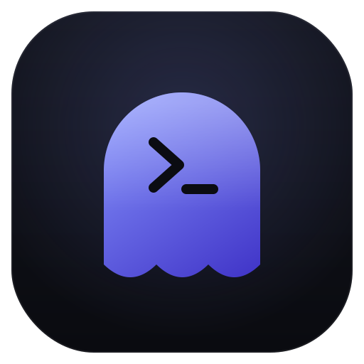

<p align="center">
  
</p>

<h1 align="center">ghostpwn</h1>

Automated penetration-test orchestration engine for authorized engagements.

ghostpwn runs YAML-defined workflows that chain security-tooling stages (recon,
scanning, reporting) across a dependency DAG. It resolves stage dependencies,
runs independent stages in parallel, passes structured data between stages, and
consolidates everything into a single report. Think "CI for pentest workflows":
you describe the stages and how they connect, ghostpwn schedules and runs them
and hands you an auditable result.

It orchestrates pluggable tool adapters, including your own tools (for example
ghostrecon and ghostmap) wired in through a generic command adapter, and ships
with built-in adapters plus a deterministic mock adapter so it is fully runnable
and testable without any external tools installed.

## Authorized use only

ghostpwn is built for authorized security assessments. Only run it against
systems you own or have explicit, written permission to test. The operator is
solely responsible for staying within the agreed scope and the law. The bundled
example workflows default to a placeholder target; the offline examples touch no
network at all.

## Install

Requires Python 3.11+.

```bash
git clone https://github.com/joemunene-by/ghostpwn
cd ghostpwn
python -m venv .venv && source .venv/bin/activate
pip install -e ".[dev]"
```

This installs the `ghostpwn` console script.

## Quickstart

Run the fully offline mock workflow and see the consolidated report:

```bash
ghostpwn run examples/mock_recon.yaml
```

Sample console report:

```
╭─────────────────────────────────────────────╮
│ ghostpwn run: mock-recon-demo  target=example.com │
╰─────────────────────────────────────────────╯
                         Stage results
┏━━━━━━━━━━━━━┳━━━━━━━━━┳━━━━━━━━━┳━━━━━━━━━━┳━━━━━━━━━━┳━━━━━━━━┓
┃ stage       ┃ adapter ┃ status  ┃ duration ┃ findings ┃ detail ┃
┡━━━━━━━━━━━━━╇━━━━━━━━━╇━━━━━━━━━╇━━━━━━━━━━╇━━━━━━━━━━╇━━━━━━━━┩
│ discover    │ mock    │ success │    0.00s │        1 │        │
│ enumerate   │ mock    │ success │    0.00s │        1 │        │
│ fingerprint │ mock    │ success │    0.00s │        1 │        │
│ report      │ mock    │ success │    0.00s │        0 │        │
└─────────────┴─────────┴─────────┴──────────┴──────────┴────────┘
                       Findings rollup
┏━━━━━━━━━━┳━━━━━━━━━━━━━━━━━━━━━━━━━━━━━━━━━┳━━━━━━━━━━━━━━━━━━━┓
┃ severity ┃ title                          ┃ description       ┃
┡━━━━━━━━━━╇━━━━━━━━━━━━━━━━━━━━━━━━━━━━━━━━━╇━━━━━━━━━━━━━━━━━━━┩
│ medium   │ outdated TLS configuration ... │ Server ... TLS 1.0│
│ low      │ open SSH service on 10.0.0.5   │ Port 22 accepts ..│
│ info     │ host 10.0.0.5 responds ...     │ ICMP echo reply   │
└──────────┴────────────────────────────────┴───────────────────┘
╭──────────────────────────────────────────────────────────────╮
│ PASS  stages: 4 ok, 0 failed, 0 error, 0 skipped  |  findings:│
│ 0 critical, 0 high, 1 medium, 1 low, 1 info                   │
╰──────────────────────────────────────────────────────────────╯
```

Inspect the resolved DAG and the parallel execution layers:

```bash
ghostpwn graph examples/mock_recon.yaml
```

List registered adapters:

```bash
ghostpwn adapters
```

## CLI

| Command | Description |
| --- | --- |
| `ghostpwn run <workflow.yaml>` | Validate and execute a workflow, emit the report. |
| `ghostpwn validate <workflow.yaml>` | Parse and semantically validate without running. |
| `ghostpwn graph <workflow.yaml>` | Print topological order and parallel layers. |
| `ghostpwn adapters` | List every registered adapter. |
| `ghostpwn version` | Print the version. |

Flags for `run`: `--target`, `--var key=value` (repeatable), `--output DIR`,
`--format {console,json}`, `--concurrency N`, `--dry-run`, `--verbose`.

## Workflow schema

A workflow is a YAML mapping with a `name`, an optional `target`, optional shared
`vars`, and a list of `stages`. Each stage has an `id`, an `adapter`, optional
`params`, and optional `needs` (the ids it depends on).

```yaml
name: web-assessment            # required, unique workflow name
target: example.com             # optional default target, overridable with --target
vars:                           # optional shared variables
  scheme: https

stages:
  - id: dns                     # required, unique within the workflow
    adapter: dns_recon          # required, must be a registered adapter
    description: "Resolve records."
    params:                     # adapter-specific, templated (see below)
      domain: "${{ target }}"
      records: ["A", "AAAA", "MX"]

  - id: probe
    adapter: http_probe
    needs: [dns]                # runs only after `dns` completes
    params:
      url: "${{ vars.scheme }}://${{ target }}"

  - id: nmap
    adapter: command
    needs: [dns]                # independent of `probe`, runs in parallel with it
    continue_on_error: true     # a failure here does not skip dependents
    timeout: 120                # per-stage timeout in seconds
    params:
      cmd: nmap
      args: ["-Pn", "-F", "${{ target }}"]
      allow_nonzero: true
```

Per-stage options: `continue_on_error` (default false), `timeout` (seconds,
optional), `description` (optional).

## DAG, parallelism, and data passing

ghostpwn builds a directed acyclic graph from the `needs` edges. It:

- topologically sorts stages and rejects cycles with a clear error,
- groups stages into layers where everything in a layer can run concurrently,
- runs stages in parallel up to `--concurrency`, honouring `needs` ordering,
- enforces per-stage timeouts.

Stages pass data forward. A later stage references an earlier stage's structured
outputs, or workflow vars, or the target, using a restricted `${{ ... }}` syntax:

- `${{ target }}` resolves the workflow target.
- `${{ vars.key }}` resolves a workflow variable.
- `${{ stages.<id>.outputs.<key> }}` resolves a prior stage's output.
- List indices are supported: `${{ stages.discover.outputs.hosts.0 }}`.

Substitution is a pure dictionary walk. There is no `eval` or `exec` and no
arbitrary expression evaluation, so a template can never execute code. Unknown
references raise an error instead of silently resolving to an empty string. When
a whole param value is a single expression, the resolved value keeps its native
type (a list stays a list); embedded expressions are interpolated as strings.

## Failure policy

- A stage that fails or errors marks its transitive dependents as `skipped`.
- A stage marked `continue_on_error: true` lets its dependents run anyway.
- Independent stages are unaffected by an unrelated failure.
- A run's overall status is PASS only if no stage failed or errored.

## Adapters

| Adapter | Purpose |
| --- | --- |
| `mock` | Deterministic, side-effect-free. Powers demos and tests. |
| `command` | Run any external CLI safely (argv vector, no shell, timeout, JSON parse). |
| `http_probe` | Probe an HTTP endpoint and assess security headers (httpx). |
| `dns_recon` | Resolve DNS records for a domain (dnspython). |

### Wiring real tools (ghostrecon, ghostmap, nmap)

The `command` adapter is the seam for running real tools with zero code changes.
It executes an explicit argument vector with `shell=False`, so there is no
shell-injection surface, captures stdout and stderr, enforces a timeout, and can
parse JSON output into structured stage outputs that later stages template on.

```yaml
- id: recon
  adapter: command
  params:
    cmd: ghostrecon
    args: ["scan", "${{ target }}", "--profile", "passive", "--format", "json"]
    parse_json: true
    timeout: 120

- id: map
  adapter: command
  needs: [recon]
  params:
    cmd: ghostmap
    args: ["--target", "${{ target }}", "--json"]
    parse_json: true
```

See `examples/ghost_tools.yaml` for a full chain.

### Adding an adapter

Subclass `Adapter`, set a unique `name`, implement `run`, and register it.

```python
from ghostpwn.adapters import register
from ghostpwn.adapters.base import Adapter, StageContext
from ghostpwn.models import StageResult, StageStatus, Finding, Severity


class MyAdapter(Adapter):
    name = "my_tool"

    def validate_params(self, params: dict) -> None:
        if "target_path" not in params:
            from ghostpwn.errors import AdapterError
            raise AdapterError("my_tool requires 'target_path'")

    def run(self, context: StageContext) -> StageResult:
        # `run` may be sync (run in a worker thread) or `async def` (awaited).
        return StageResult(
            stage_id=context.stage_id,
            adapter=self.name,
            status=StageStatus.SUCCESS,
            outputs={"checked": context.param("target_path")},
            findings=[Finding(title="example", severity=Severity.INFO)],
        )


register(MyAdapter())
```

Adapters receive a `StageContext` with the resolved `params`, the `target`,
workflow `vars`, and `prior_outputs`, and return a `StageResult` carrying a
status, structured `outputs`, `findings`, and `artifacts`.

## Output

`--output DIR` persists `report.json` plus per-stage JSON under `DIR/stages/`.
`--format json` prints the consolidated report as JSON to stdout.

## Roadmap

- Adapter plugins discovered via entry points.
- Retry and backoff policies per stage.
- Severity-threshold gating (fail the run above a severity).
- Native adapters for additional tools in the ghost suite.
- SARIF and HTML report exporters.

## License

MIT, see [LICENSE](LICENSE).
